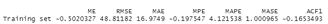
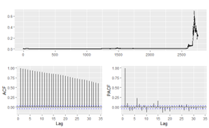

# ETHEREUM AND DOGECOIN CLOSING PRICE FORECASTING

### INTRODUCTION

During the recent time cryptocurrencies have become the latest attraction. Ethereum and Dogecoin are one such alternatives to traditional cryptocurrencies like Bitcoin. 
Thousands of computers around the world compete to mine these cryptocurrencies. As their popularity has surged, competition of mining of these cryptocurrencies has 
increased too. Just like Bitcoin, Ethereum’s and Dogecoin’s prices are based on global marketplace of supply and demand and hence, their prices can keep fluctuating. 
The main aim of this project is to build an accurate forecasting model for the closing price of the Ethereum and Dogecoin cryptocurrency using the dataset from an 
entire year.

---

### DATASET DESCRIPTION AND APPROACH

As a part of model identification for this particular use case, we will use the Box-Jenkins methodology. We will then select a suitable model after comparing AICs and 
parameter estimation using the maximum likelihood estimation. We will then build our final observations by looking at the Autocorrelation function (ACF) and Partial 
autocorrelation function (PACF) of the residuals. The dataset consists of history of daily prices of Ethereum and Dogecoin cryptocurrencies from the period 09-Aug-2015 
to 07-Jul-2021. We will be using two datasets one for the forecasting the value of Ethereum cryptocurrency while the other one for forecasting the value of Dogecoin 
cryptocurrency. The data has been referred from Kaggle. The features present in this dataset and its description are as follows:

- SNo (integer): Serial Number: Unique identifier of the Ethereum/Dogecoin dataset.
- Name (string): Name of the coin
- Symbol (string): Symbol or Acronym associated with Ethereum/Dogecoin
- Date (Date time in form of string): Time and Date of when the instance was created
- High (float): The greatest value of the coin at that time
- Low (float): The lowest value of the coin at that time
- Open (float): Opening price on the given day
- Close (float): Closing price on the given day
- Volume (float): Volume of transactions on the given day
- Marketcap (float): Market capitalization in USD or the total value of all the coins that have been mined in USD.

Dataset: https://www.kaggle.com/datasets/sudalairajkumar/cryptocurrencypricehistory

---

### RESULTS

**ETHERIUM** 

**Dogecoin** 

There is a very clear upward trend in the data, several sharp changes, and the mean is in no way constant over time. All of these are red flags that the data is not
stationary. From looking at the data that seasonality is an issue since there is no consistent change that occurs periodically. The issue of the trend can and will be 
addressed via differencing. The sharp changes do make a difference in terms of the variance, which we will attempt to make constant via power transformations such as 
through the Box-Cox transformation. The ACF of the data decays gradually, whereas the PACF cuts off abruptly. The gradual decay of the ACF tells that differencing is 
required for the data. After transforming and differencing the data a trend and seasonality issues are addressed. To train the model we have directly choose to train 
using Auto Arima as it would provide the best possible parameters. It can be viewed that the AIC value is -5873.91 with a drift of 0.0038 and standard error 0.0018, 
and AIC value of -5864.4 with a drift of 0.0026 and standard error of 0.0016. So the AIC is pretty small and the drift is insignificant as it is within the confidence 
intervals.

The rmse for Ethereum model is 48.81182 and for Dogecoin model is 0.009329465.

- For Etherium,
  Xt − 0.9520Xt−1 = Zt + 0.933Zt−1
- For Dogecoin:
  Xt = Zt − 0.0609Zt−1 + 0.0525Zt−2

Zt : the approximate white noise and variance 0.003845 & 0.006976 respectively.

---

### CONCLUSION

We then use our model to forecast for the next 12 months setting h as 12:

We can observe that our model predicted a large confidence interval. We are unable to predict a small interval, but we can be certain that the futures values will be 
within this interval. As we increase our forecast further the confidence intervals will become larger. Our data had heteroskedasticity so ARIMA might not have been a 
good choice to use as our model. A better approach would have been to use GARCH model instead, which would help with the non-constant variance. But instead of prediction,
our model can be aimed better to detect anomalies, like pumping and dumping, in bitcoin transactions utilizing if the values fall out of the forecasted confidence interval.

---
